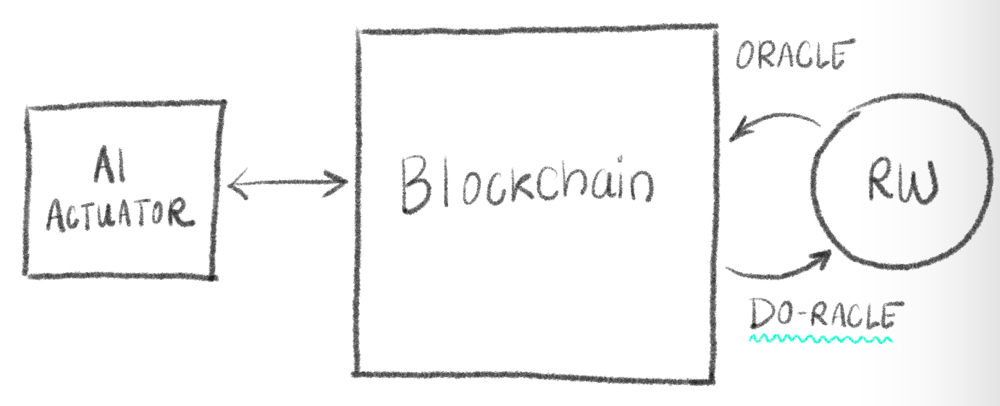
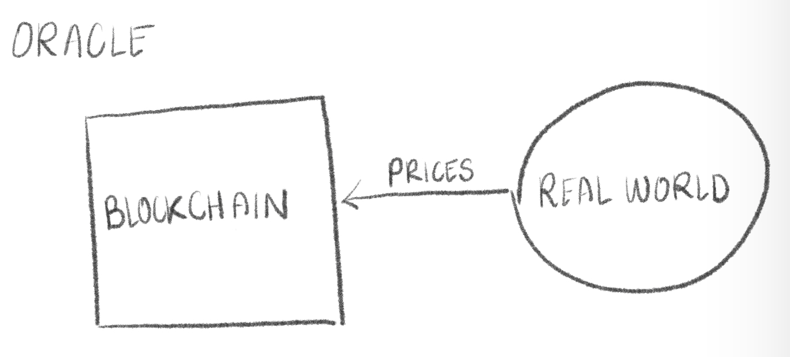
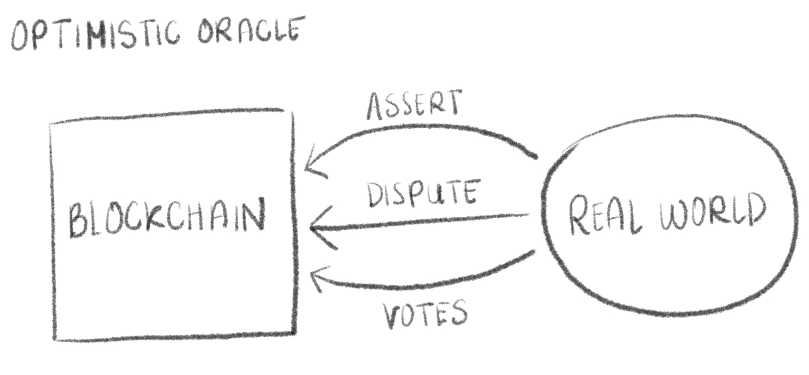
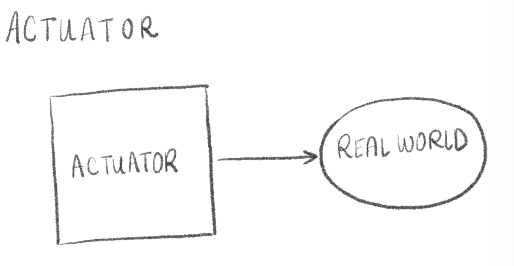
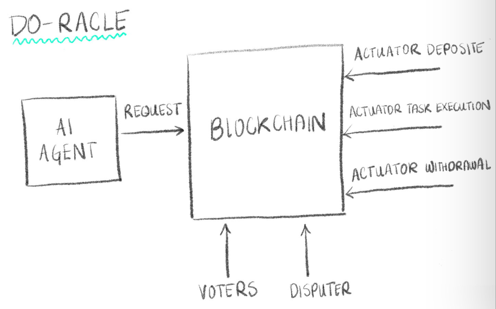
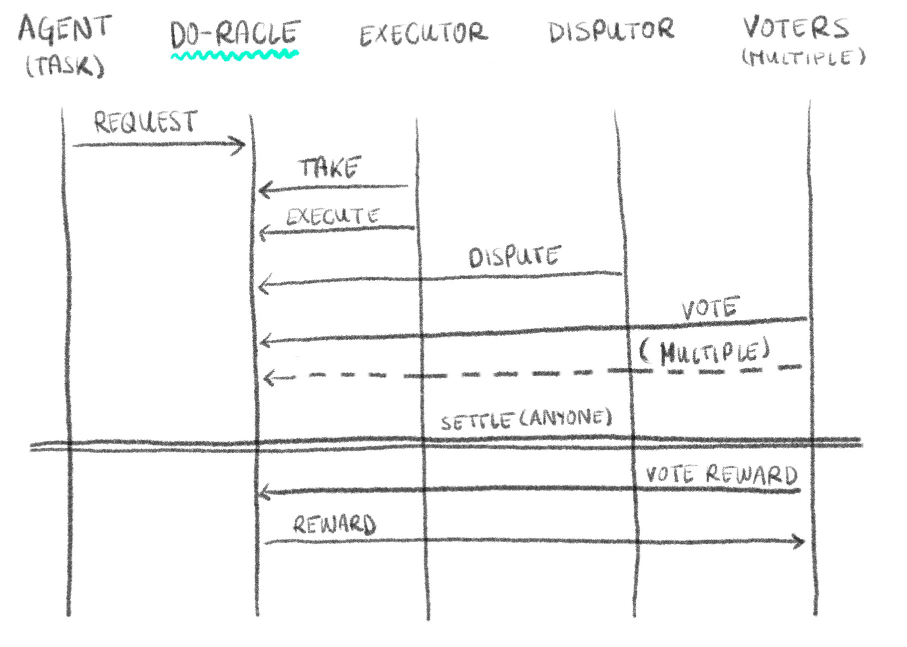

[This project, (Do-racle: Decentralized Trustless Universal Actuator for Real World AI Agents)](https://devfolio.co/projects/doracle-4b9e) won the following prize at the [ETHDenver 2025](https://ethdenver2025.devfolio.co/overview) Buidlathon:

<svg width="1em" height="1em" viewBox="0 0 24 24" fill="none" xmlns="http://www.w3.org/2000/svg"><path d="M16.243 11.757l5.25-4.886a1.3 1.3 0 00.144-1.745l-1.247-1.62A1.3 1.3 0 0019.36 3H5m7 7l3-3m-3 3L9 7m3 3a6 6 0 100 12 6 6 0 000-12zm3-3H9m6 0l4-4M5 3a1.3 1.3 0 00-1.03.507L2.7 5.154a1.3 1.3 0 00.117 1.718l4.94 4.885M5 3l4 4" stroke="currentColor" stroke-width="1.5"></path></svg> [U2U Network: Second Prize: Building RWA products on U2U Network</a>](https://ethdenver2025.devfolio.co/projects?prizes=9c4deca78ff54180b69d7c0934c18f92&show_winners=false)

# Do-racle: Decentralized Trustless Universal Actuator for Real World AI Agents

Demo video, running instructions and contract deployment addresses can be found [here](./demo/README.md).

## Abstract

We built a decentralized economically incentivized on-chain actuator that can be used by AI Agents to achieve their real world action objectives. It runs on Ethereum Virtual Machine (EVM) and LangChain AI Agents using our Tools. Agents with access to EVM keys can ask anyone for Actions that they desire and offer reward for the Execution of such Actions. Anyone can deposit the required funds to accept the task, execute the desired Action and receive the appropriate reward for the Execution. If the action is not executed within a Dispute period, the acceptance deposit is lost. Anyone can Dispute the Action correctness, and trigger Voting similar to the one in Optimistic Oracles, such as UMA. The voting decides who is right and who shall receive the deposited funds or get slashed.

## Introduction

### Oracles and Optimistic Oracles

***Oracles*** are a way to enter off-chain data into the blockchain, which can then be read by various smart contracts. This gives the smart contracts access to the Real World information (Sensors). Oracles serve an important role in Decentralized Finance (DeFi).

***Optimistic Oracles*** (notably UMA), allow anyone to enter data into the blockchain (make an ***Assertion***) and make a deposit which vouches for the truthfulness of the Assertion. Anyone can ***Dispute*** this Assertion by depositing funds with the dispute claim. These funds are returned to the Disputer if the corresponding Assertion turns out to be false, in addition to the Asserter's deposit less a small fee imposed by the protocol. The Dispute has to be triggered within a Dispute Period and it has to be Voted on by the Optimistic Oracle stakeholders, which get rewarded for their voting.

*** Highlighting the difference*** The main difference between an orcale and an optimistic oracle is the number of actors at each stage. In oracle many actors enter quantifiable data and the outliers are penalized. This is optimised to be fast as their typically is no voting period. Alternatively in optimistic oracles one actor enters a binary data, there is no continuous pricing or quantiability. There is a dispute period where any one person can challenge the entry. If disputed there is voting regarding this challenege of accuracy.

| Protocol          | Property          | Function |
|-------------------|-------------------|----------|
| Oracle            | Quantifiable Data | Sensor   |
| Optimistic Oracle | Boolean Data      | Sensor   |
| DO-racle          | Boolean Action    | Actuator |

### Actuators

In DeFi, all or most actions are executed on-chain causing financial effect. However, Real World actions have to be performed by actuators. This is not a problem if the actuator is called by a single off-chain program and this program has deterministic behavior and is calling for known actions. The Actuators can be designed or integrated specifically for that deterministic program.

For example, an Actuator for controlling a light switch may be developed and integrated with a program which reads on-chain state information when it receives on-chain events. This on-chain state tells the actuator whether to turn the light switch on or off.

#### Problem: Actuators for AI Agents

AI Agents can have an unpredictable yet rational behavior, and call for actions for which there is no available Actuator.

#### Problem: Remote Actuators

What if the AI Agent has to act remotely, and advertize a request for anyone to execute a remote action. How can such remote Actuator be triggered and then trusted?

Example: A fictitious pet, called Bufficon has to be fed regularly, and an AI Agent can be put in charge to make sure the Bufficon is fed. The Bufficon owner has to go out of town and put the AI Agent up to this task. The AI Agent can use Oracles to read the status (mood, hunger) of the Bufficon, but it needs an Actuator in order to perform the feeding. As such Actuator does not exist, it would be useful to be able to ask a volunteer to feed the Bufficon and receive a reward for it. Such volunteer would be hard to find, as there is no standard protocol of incentivization and trusted reward for the action.

## Solution: DO-racle Protocol

We named it ***"DO-racle"*** to hint to the opposite action of Oracle, which acts as Sensor. DO-racle acts as Actuator.

The DO-racle Protocol is a standardized ***economically incentivized*** protocol for performing Decentralized Real World actions, while assuring the following:
-  The actions can be trustlessly requested by anyone (***Requester***) who creates an ***Action Description***, and deposits ***Reward*** for the completion of the desired ***Action***.
- Anyone (***Actor***) can pick up an advertized Action Description and take responsibility for the task (Action) by depositing ***Guarantee*** funds as stated in the Action Description. The Guarantee funds are lost to the requester and the protocol (shared) of the Action is not performed as described (quality, timeliness). If the Action is performed as requested, the Actor shall receive the Reward deposited by the Requester.
- To decide whether the action has been performed as requested, the Do-racle Protocol has components similar to the Optimistic Oracle protocols, in which stakeholders (Token Holders) of the DO-racle protocol vote for the correctness decision and receive reward for the voting. To allow this, the action has a ***Dispute Period*** specified in its description as well as ***Voting Period***, which acts as a deadline for the voters.

The interactions are as follows:

## Implementation

DO-racle protocol is implemented as a collection of smart contracts written in Solidity, which execute on any EVM. 

There is also a rudimentary user interface written in JavaScript/React for showing advertized Action Descriptions as well as voting on the correctness on the Action completions.

The Agent interface is written in Python/LangChain and it is architected as a LangChain Tool.

There are a few command-line ZSH utilities for scripting automation of usage of the Action Execution, as well as configuration and setup.

## Future Work

### Safeguards

Malicious requests can be made by anyone, trustlessly, using economic incentives. The DO-racle protocol has no way of preventing such bad actors. Even if such safeguards exist, anyone could create a copy of the protocol with the safeguards removed. We believe such safeguards should be placed on the AI Agent side. Yet this topic is open for discussions that reach far beyond the scope of this prototype.

## Reputation System

A reputation system can be built based on previous history for each address creating and taking Do-racle Actions. This could add to the reliability of the advertized Actions.